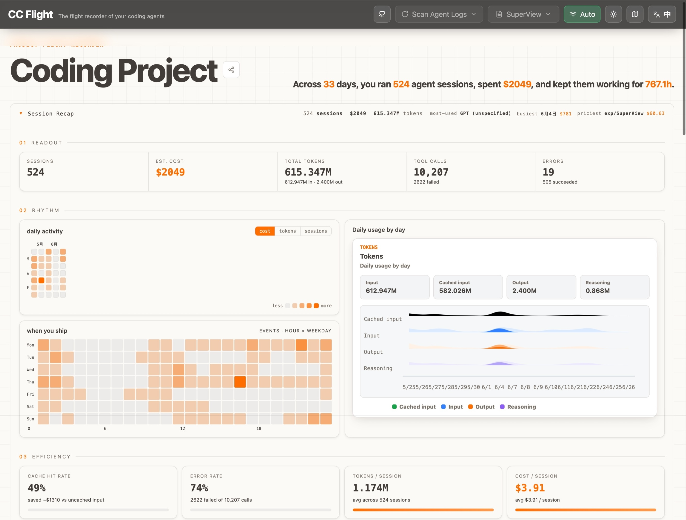
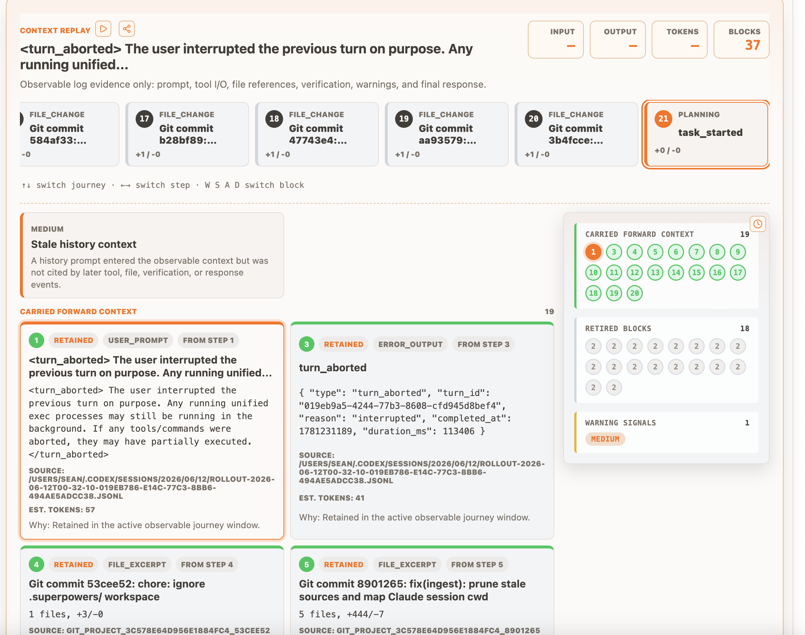
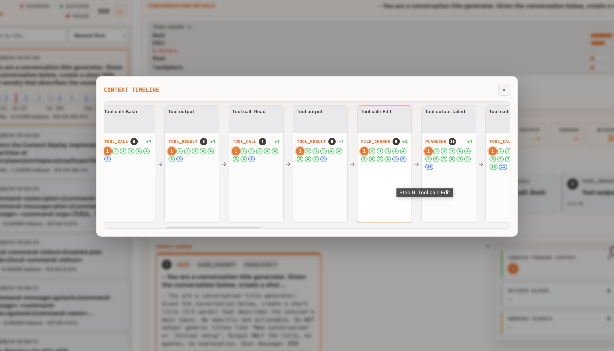
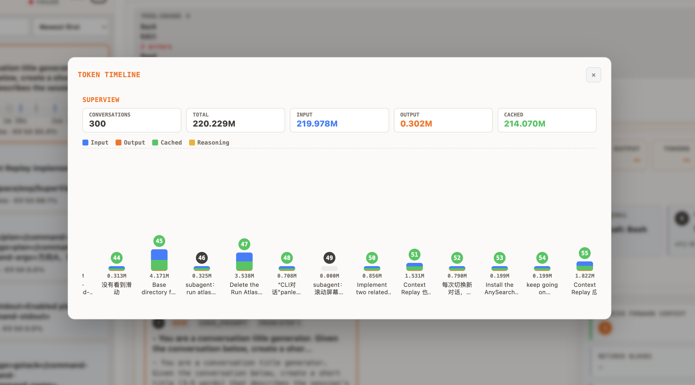
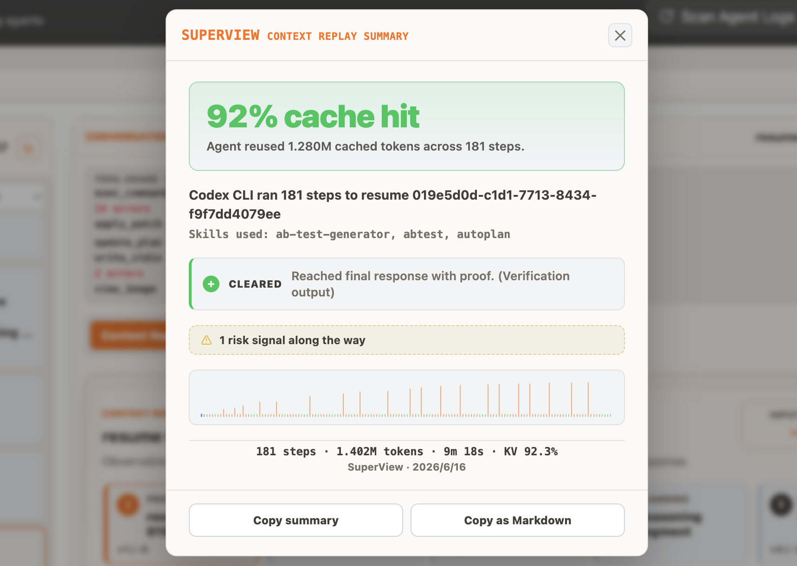
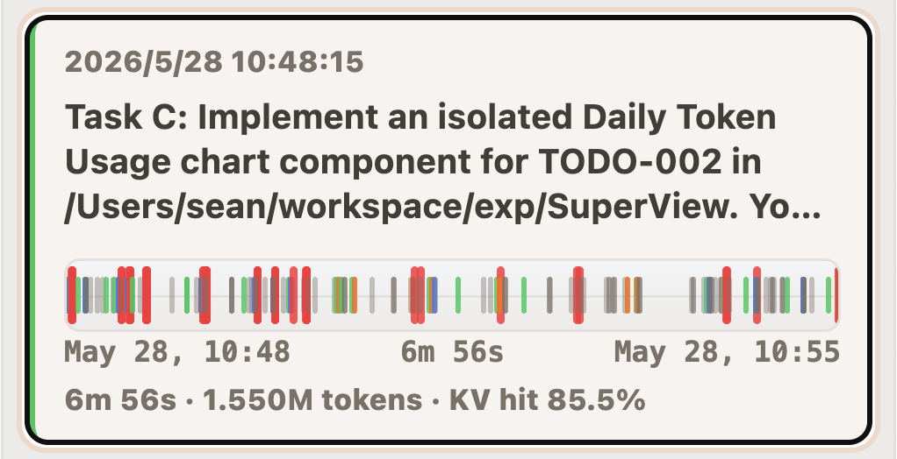

# SuperView

[English](README.md) | [简体中文](README.zh-CN.md)

## Quick Start

```bash
npx @seanxdo/superview
```

Or install globally:

```bash
npm install -g @seanxdo/superview
superview
```

Launch pre-focused on a project directory — SuperView auto-scans and selects that project on open:

```bash
superview .                          # current directory
superview /path/to/your/project      # absolute path
superview --project-dir=/path/to/project
```

Then open **http://127.0.0.1:5174** and scan your agent logs.

SuperView is a local-first flight recorder for coding agents. It ingests session logs from Codex, Claude Code, and OpenCode, reconstructs every task journey, and surfaces hidden agent work — context snapshots, tool calls, cost, errors, and project telemetry — in a single dashboard.

## Preview

<table>
  <tr>
    <td></td>
    <td></td>
    <td></td>
  </tr>
  <tr>
    <td></td>
    <td></td>
    <td></td>
  </tr>
</table>

## Features

### Session Recap

A collapsible flight-recorder readout panel with five sections:

- **01 Readout** — Sessions, estimated cost, total tokens, tool calls, errors, most-used model, busiest day, and priciest session.
- **02 Rhythm** — Daily activity calendar heatmap, hour×weekday clock heatmap, and daily token usage chart.
- **03 Efficiency** — Cache hit rate, error rate, tokens per session, and cost per session with animated gauges.
- **04 Spend by Model** — Per-model cost breakdown with editable token pricing.
- **05 Tool Usage** — Horizontal bar chart of tool call frequency with error indicators.

### Context Replay

A snapshot-by-snapshot walkthrough of the agent's context window:

- Numbered step rail showing phase, title, and +added/-dropped content per step.
- Auto-play mode (cycles snapshots every 2.8s).
- Context blocks grouped by state: carried forward, newly added, changed, dropped.
- Warning strip for stale context, contradictions, and missing files.
- **Factory Strip** — A full-width belt view of all snapshots with active blocks and transitions.

### Token Timeline

A vertical bar chart of token usage per journey, segmented by input/output/cached/reasoning. Click any bar to jump to that journey. Summary bar with conversation count, total tokens, and per-type breakdown.

### Share Card

One-click summary generation for any task journey — hero stat, skills used, verdict (cleared/failed/in-progress), token sparkline, and copy-as-Markdown support.

### Event Tape

A horizontal mini-timeline on every journey row showing categorized events (user, assistant, tool, thinking, error) with tooltip details on hover.

### Cost Estimation

Built-in pricing table for Claude and GPT models (June 2026 rates). All rates are editable in-place. Costs are computed from raw token usage with cache read/write multipliers. Supports per-model cost aggregation.

### Multi-Provider Support

| Provider | Source | Default Path |
|----------|--------|--------------|
| Codex CLI | Session JSONL files | `~/.codex/sessions/**/*.jsonl` |
| Claude Code | Project JSONL files | `~/.claude/projects/**/*.jsonl` |
| OpenCode | Exported session files | Manual export |

### Theme & Language

Four themes: Bright Command Center (default), Dark Command Center, Forest Lab, Plasma Violet. Full bilingual support: English and Simplified Chinese. Preferences persist across sessions.

## Development

```bash
pnpm install
pnpm dev          # Start API + Vite dev server
```

Open the app:

```
http://127.0.0.1:5173/
```

The API server runs at:

```
http://127.0.0.1:5174/
```

### CLI Ingest

```bash
pnpm ingest /path/to/.codex
```

### API Ingest

```bash
curl -X POST http://127.0.0.1:5174/api/ingest \
  -H 'Content-Type: application/json' \
  -d '{"sources":[{"provider":"codex"}]}'
```

Claude Code:

```bash
curl -X POST http://127.0.0.1:5174/api/ingest \
  -H 'Content-Type: application/json' \
  -d '{"sources":[{"provider":"claude-code","root":"/path/to/.claude"}]}'
```

OpenCode:

```bash
curl -X POST http://127.0.0.1:5174/api/ingest \
  -H 'Content-Type: application/json' \
  -d '{"sources":[{"provider":"opencode","path":"/path/to/opencode-export.json"}]}'
```

Poll job status:

```bash
curl http://127.0.0.1:5174/api/ingest/jobs/<jobId>
```

### Scripts

```bash
pnpm dev          # Start API and Vite client
pnpm dev:server   # Start the Express API only
pnpm dev:client   # Start the Vite client only
pnpm start        # Start production server (single port, serves API + UI)
pnpm build        # Typecheck and build the UI
pnpm typecheck    # Run TypeScript checks
pnpm test         # Run Vitest tests
pnpm test:e2e     # Run Playwright tests
```

## API Reference

| Endpoint | Method | Description |
|----------|--------|-------------|
| `/api/health` | GET | Health check |
| `/api/ingest` | POST | Start ingest job |
| `/api/ingest/jobs/:id` | GET | Poll ingest progress |
| `/api/projects` | GET | List all projects |
| `/api/projects/:id/timeline` | GET | Get project timeline |
| `/api/projects/:id/token-usage/daily` | GET | Daily token usage |
| `/api/task-journeys/:id` | GET | Journey detail |
| `/api/task-journeys/:id/context-replay` | GET | Context replay data |
| `/api/events/:id/evidence` | GET | Event evidence |
| `/api/runs/:id` | GET | Run replay |
| `/api/reset` | POST | Reset database |

## Architecture

```text
ui/            React + Vite dashboard
runtime-node/  Express API, ingest service, worker process, log adapters
core/          Parser, normalizer, redactor, cost engine, timeline, context replay
storage/       SQLite database layer and local data paths
```

The ingest path is intentionally split from the API. The API creates an ingest job and returns immediately. A worker process scans and parses log files, then writes normalized data into SQLite. This keeps the dashboard responsive during large historical scans. Ingest uses single-flight behavior — if one is already active, subsequent requests return the existing job.

## Environment Variables

```bash
SUPERVIEW_DATA_DIR     # Data directory (default: ./.superview)
SUPERVIEW_CODEX_HOME   # Codex log root (default: ~/.codex)
SUPERVIEW_CLAUDE_HOME  # Claude Code log root (default: ~/.claude)
SUPERVIEW_PORT         # Production server port (default: 5174)
```

## Privacy

SuperView is local-first. No accounts, no cloud sync, no remote backend. Raw agent logs stay on your machine. Normalized records are stored in a local SQLite database. Evidence views expose only redacted payloads with source provenance (path, line, timestamp, hash) — enough for debugging, not raw dumps.
